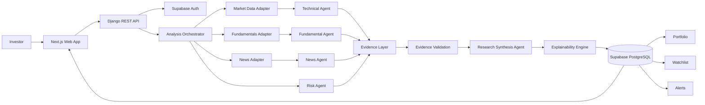
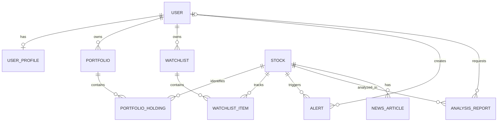

# StockLens

### Explainable AI Market Intelligence

> **StockLens is an evidence-driven market intelligence platform that combines multi-agent analysis, real market data, and explainable AI to turn financial signals into structured research.**

---

## Overview

StockLens is designed around one principle:

**AI should reason over evidence, not generate the evidence.**

The platform combines:

- Technical analysis
- Fundamental analysis
- News & sentiment
- Risk intelligence
- Multi-agent research
- Explainable AI synthesis
- Portfolio & watchlist intelligence
- Threshold-based alerts

---

## Architecture



---

## Core Workflow

```text
Investor
   ↓
Next.js Application
   ↓
Django API
   ↓
Authentication & Authorization
   ↓
Analysis Orchestrator
   ↓
┌─────────────┬──────────────┬─────────────┐
│ Market Data │ Fundamentals │ News        │
└──────┬──────┴───────┬──────┴──────┬──────┘
       ↓              ↓             ↓
  Technical      Fundamental     News Agent
     Agent          Agent
       └──────────────┼─────────────┘
                      ↓
                  Risk Agent
                      ↓
               Evidence Layer
                      ↓
             Evidence Validation
                      ↓
             AI Research Synthesis
                      ↓
               Explainability
                      ↓
               Research Report
                      ↓
             PostgreSQL Storage
                      ↓
        Portfolio / Watchlist / Alerts
```

### How it works

**01. Request** — Investor selects a stock or research action.

**02. Resolve** — API validates the stock symbol against the canonical stock registry.

**03. Collect** — Provider adapters collect market, fundamental and news data.

**04. Analyze** — Specialized agents independently analyze their domain.

**05. Validate** — Evidence is normalized, timestamped and checked before reaching the AI layer.

**06. Synthesize** — The research agent reasons over validated evidence and produces a structured report.

**07. Explain** — Conclusions are connected to the evidence supporting them.

**08. Persist** — Reports and user-owned resources are stored in PostgreSQL.

**09. Monitor** — Watchlists and alerts extend one-time research into continuous intelligence.

---

# Multi-Agent Intelligence

| Agent | Responsibility |
|---|---|
| **Technical Agent** | RSI, SMA/EMA, MACD, momentum, volatility, trend |
| **Fundamental Agent** | Earnings, valuation, growth, margins, leverage, returns |
| **News Agent** | News collection, event detection, sentiment |
| **Risk Agent** | Drawdown, volatility, liquidity, leverage, concentration |
| **Research Agent** | Cross-domain reasoning and final synthesis |
| **Explainability Engine** | Maps conclusions back to supporting evidence |

The LLM is intentionally placed **after the evidence layer**.

```text
External Data
     ↓
Normalized Evidence
     ↓
Validation
     ↓
AI Reasoning
     ↓
Explainable Output
```

---

# Technology Stack

### Frontend

<p>


</p>

### Backend

<p>


</p>

### Data & Auth

<p>


</p>

### AI & Analytics

<p>


</p>

**Frontend:** Next.js · React · TypeScript · Tailwind · Zustand · Recharts · Framer Motion

**Backend:** Python · Django · Django REST Framework

**Data:** Supabase PostgreSQL · Provider APIs

**AI:** Multi-agent architecture · LLM synthesis · Explainability layer

---

# Data Model



Core entities:

`User` · `UserProfile` · `Stock` · `Portfolio` · `PortfolioHolding` · `Watchlist` · `WatchlistItem` · `Alert` · `AnalysisReport` · `NewsArticle`

---

# API

### Public Research

```http
GET  /api/health/
GET  /api/stocks/
GET  /api/stocks/{symbol}/
GET  /api/stocks/{symbol}/technicals/
GET  /api/stocks/{symbol}/fundamentals/
GET  /api/stocks/{symbol}/news/
POST /api/stocks/{symbol}/analyze/
GET  /api/analysis/{id}/
```

### Authenticated

```http
GET/PATCH /api/profile/
GET/POST/PUT/PATCH/DELETE /api/portfolios/
GET/POST/PUT/PATCH/DELETE /api/watchlists/
GET/POST/PUT/PATCH/DELETE /api/alerts/
```

---

# Security

```text
Supabase Auth
      ↓
Bearer Token
      ↓
Django Validation
      ↓
Local User
      ↓
Owner-Scoped Resources
```

- Authentication handled by Supabase.
- Django validates bearer tokens.
- Private resources are filtered by `request.user`.
- Passwords are never stored by Django.
- Secrets remain in environment variables.
- Unauthorized private resources return `404` to avoid leaking existence.

---

# Safe Provider Architecture

StockLens never substitutes missing provider data with generated values.

```json
{
  "error": "market_data_provider_not_configured",
  "detail": "The market_data provider is not configured."
}
```

This makes the system fail **predictably instead of deceptively**.

Provider integrations remain isolated behind adapters, allowing providers to be replaced without changing the core analysis architecture.

---

# Development

### Backend

```powershell
python -m venv .venv
.\.venv\Scripts\Activate.ps1

cd backend
pip install -r requirements.txt
python manage.py migrate
python manage.py runserver
```

### Frontend

```powershell
Copy-Item .env.local.example .env.local
npm install
npm run dev
```

### Local URLs

```text
Frontend → http://localhost:3000
Backend  → http://127.0.0.1:8000
Health   → http://127.0.0.1:8000/api/health/
```

### Verification

```bash
python manage.py check
python manage.py test --settings=config.test_settings

npm run lint
npx tsc --noEmit
npm run build
```

---

# Roadmap

```text
MVP
 ↓
Real Market Data + Fundamentals + News
 ↓
Technical & Risk Engines
 ↓
Evidence-Grounded AI
 ↓
Real-Time Intelligence
 ↓
Event-Driven Alerts
 ↓
Portfolio Risk & Optimization
 ↓
Research Memory + Personalization
 ↓
Backtesting & Advanced Intelligence
```

---

# Why StockLens?

Most platforms expose **charts, metrics and news**.

Generic AI tools provide **answers**.

StockLens connects the two:

```text
Real Market Evidence
        ↓
Specialized Agents
        ↓
Evidence Validation
        ↓
Cross-Domain Reasoning
        ↓
Explainable Intelligence
```

### Core Differentiator

> **StockLens is not an AI chatbot that talks about stocks.**
>
> **It is an evidence-driven financial intelligence system where AI acts as the reasoning layer over verified market evidence.**

---

## Engineering Principles

```text
Evidence > Assumptions
Explainability > Black Box
Real Data > Fabricated Data
Modularity > Provider Lock-in
Security > Convenience
Parallel Agents > Sequential Bottlenecks
```

---

### Disclaimer

StockLens is a research and market-intelligence platform. It does not guarantee returns and does not constitute financial advice.
