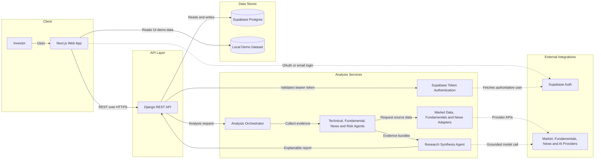
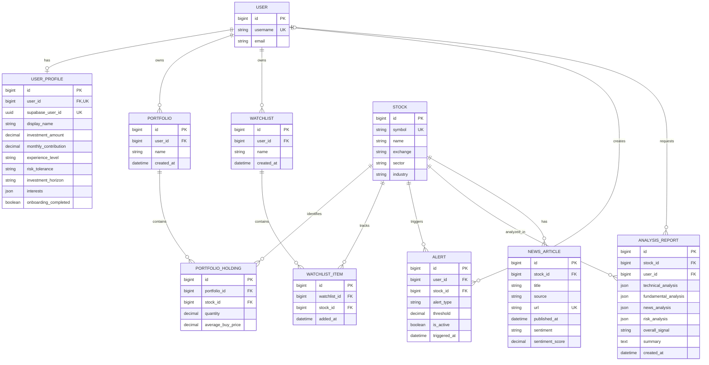

# StockLens — Explainable AI Market Intelligence

StockLens is an explainable stock-research and portfolio-analysis MVP. The existing
Next.js App Router frontend is paired with a Django REST Framework backend in `backend/`.

The frontend currently contains local demo market data. The backend never fabricates
prices, indicators, fundamentals, news, sentiment, or AI confidence scores; provider-backed
endpoints return a structured `*_provider_not_configured` error until integrations exist.

## Stack

- Next.js 16, React 19, TypeScript, Tailwind CSS, Zustand, Recharts, Framer Motion
- Django, Django REST Framework, django-cors-headers, Supabase Postgres

## System architecture

StockLens separates the interactive research experience from authentication, persisted
user data, and provider-backed market analysis. The landing-page charts currently use
local demo data; the service adapters are the integration boundary for production market,
fundamental, and news providers.



### Analysis request flow

1. The browser requests `POST /api/stocks/{symbol}/analyze/`, optionally with a
   Supabase access token.
2. Django resolves the stock and the orchestrator invokes the technical, fundamental,
   news, and risk agents.
3. Agents obtain evidence through provider adapters; the research agent combines that
   evidence into an explainable result.
4. Django stores the report. Anonymous reports are public, while authenticated reports
   are visible only to their owner.
5. Until the external providers and synthesis implementation are configured, the API
   returns a structured `503` or `501` instead of fabricated analysis.

## Data model

| Entity | Purpose | Important constraints |
| --- | --- | --- |
| `User` | Django identity provisioned from a verified Supabase identity | One optional `UserProfile`; owns private resources |
| `UserProfile` | Investor preferences, experience, goals, and onboarding state | Unique Supabase user ID; non-negative investment values |
| `Stock` | Canonical security referenced throughout the platform | Unique symbol |
| `Portfolio` | Named collection owned by one user | Holdings are deleted with the portfolio |
| `PortfolioHolding` | Stock position inside a portfolio | One row per portfolio/stock; positive quantity; non-negative buy price |
| `Watchlist` | Named stock list owned by one user | Items are deleted with the watchlist |
| `WatchlistItem` | Stock membership in a watchlist | One row per watchlist/stock |
| `Alert` | Owner-scoped price or RSI threshold | References one user and one stock |
| `AnalysisReport` | Stored technical, fundamental, news, risk, and synthesis output | User is optional; anonymous reports are public |
| `NewsArticle` | Provider article and sentiment associated with a stock | Unique article URL |

### Entity-relationship diagram

The diagram includes Django's built-in `User` because it is the ownership root for
profiles, portfolios, watchlists, alerts, and private reports.



## API design

All routes are relative to `NEXT_PUBLIC_API_BASE_URL`, which should include the `/api`
prefix (for example, `http://127.0.0.1:8000/api`). JSON is used for request and response
bodies. A trailing slash is expected by Django.

### Authentication and visibility

- Send `Authorization: Bearer <supabase-access-token>` for authenticated calls.
- Django validates the token with Supabase Auth, provisions the matching local `User`
  and `UserProfile` on first use, and never stores the user's Supabase password.
- Stocks and provider-backed research endpoints are public. Profile, portfolio,
  watchlist, and alert endpoints require authentication and filter by `request.user`.
- An analysis report is readable when it is anonymous or belongs to the caller. A
  private report owned by another user returns `404` to avoid leaking its existence.

### Endpoints

| Method | Route | Access | Design |
| --- | --- | --- | --- |
| `GET` | `/health/` | Public | Service health and identity |
| `GET` | `/stocks/` | Public | List canonical stocks |
| `GET` | `/stocks/{symbol}/` | Public | Retrieve a stock; symbol lookup is case-insensitive |
| `GET` | `/stocks/{symbol}/technicals/` | Public | Technical indicators from historical provider data |
| `GET` | `/stocks/{symbol}/fundamentals/` | Public | Valuation, earnings, growth, returns, and leverage |
| `GET` | `/stocks/{symbol}/news/` | Public | Provider news and sentiment for a stock |
| `POST` | `/stocks/{symbol}/analyze/` | Public, optional auth | Run the agent pipeline and persist a report |
| `GET` | `/analysis/{id}/` | Visibility-scoped | Retrieve a public report or the caller's private report |
| `GET`, `PATCH` | `/profile/` | Authenticated | Read or partially update the caller's profile |
| `GET`, `POST` | `/portfolios/` | Authenticated | List owned portfolios or create one |
| `GET`, `PUT`, `PATCH`, `DELETE` | `/portfolios/{id}/` | Authenticated | Manage one owned portfolio |
| `GET`, `POST` | `/watchlists/` | Authenticated | List owned watchlists or create one |
| `GET`, `PUT`, `PATCH`, `DELETE` | `/watchlists/{id}/` | Authenticated | Manage one owned watchlist |
| `GET`, `POST` | `/alerts/` | Authenticated | List owned alerts or create one |
| `GET`, `PUT`, `PATCH`, `DELETE` | `/alerts/{id}/` | Authenticated | Manage one owned alert |

Portfolio responses embed read-only `holdings`, and watchlist responses embed read-only
`items`. Dedicated write endpoints for holdings and watchlist items are not implemented yet.

### Resource examples

Create an authenticated portfolio:

```http
POST /api/portfolios/ HTTP/1.1
Authorization: Bearer <supabase-access-token>
Content-Type: application/json

{
  "name": "Long-term India"
}
```

Create an alert:

```http
POST /api/alerts/ HTTP/1.1
Authorization: Bearer <supabase-access-token>
Content-Type: application/json

{
  "stock": 1,
  "alert_type": "PRICE_ABOVE",
  "threshold": "4250.0000",
  "is_active": true
}
```

Patch the authenticated investor profile:

```http
PATCH /api/profile/ HTTP/1.1
Authorization: Bearer <supabase-access-token>
Content-Type: application/json

{
  "experience_level": "INTERMEDIATE",
  "risk_tolerance": "MODERATE",
  "investment_horizon": "LONG_TERM",
  "preferred_market": "India",
  "interests": ["Technology", "Long-term investing"],
  "onboarding_completed": true
}
```

Provider-dependent endpoints use a stable error envelope while an integration is absent:

```json
{
  "error": "market_data_provider_not_configured",
  "detail": "The market_data provider is not configured."
}
```

Expected response codes are `200` for successful reads and updates, `201` for creates,
`204` for deletes, `400` for invalid input, `401` or `403` for authentication failures,
`404` for missing or non-visible resources, `501` for missing synthesis, and `503` for
unconfigured data providers.

## Development setup (Windows PowerShell)

Create the project-root virtual environment only if `.venv/` does not already exist:

```powershell
python -m venv .venv
```

Backend:

```powershell
.\.venv\Scripts\Activate.ps1
cd backend
pip install -r requirements.txt
# Replace placeholders in backend/.env with the exact Supabase values.
python manage.py migrate
python manage.py runserver
```

The value must be the complete project-specific URI—not the literal `PROJECT_REF`,
`YOUR_PASSWORD`, or `REGION` placeholders. Copy it from **Supabase Dashboard > Connect**. Use a direct
connection for migrations and persistent backends when IPv6 is available; use the session
pooler on port `5432` for a persistent backend on IPv4-only networks. Transaction pooling
on port `6543` is also supported by the settings, which automatically disables prepared
statements and server-side cursors. Never commit the real URL or database password.

Frontend (from the project root, in another terminal):

```powershell
Copy-Item .env.local.example .env.local
npm install
npm run dev
```

Development URLs:

- Next.js: http://localhost:3000
- Django: http://127.0.0.1:8000
- Health check: http://127.0.0.1:8000/api/health/

## API configuration

The frontend API helper in `lib/api.ts` reads `NEXT_PUBLIC_API_BASE_URL`. Do not hardcode
the backend origin in components. Django permits `http://localhost:3000` through CORS by
default; override `CORS_ALLOWED_ORIGINS` with a comma-separated list when needed.

Google OAuth, email/password authentication, and personalized profiles use Supabase Auth. Follow the
complete dashboard setup in [`docs/authentication.md`](docs/authentication.md), then open
`http://localhost:3000/auth/signup` for a new account or `/auth/login` to sign in.

Optional Django environment variables:

- `SUPABASE_DATABASE_URL` — required Supabase Postgres connection URL (`DATABASE_URL` also works)
- `SUPABASE_URL` — Supabase project URL used by Django token validation
- `SUPABASE_PUBLISHABLE_KEY` — public project key used by Django token validation
- `DJANGO_SECRET_KEY` — required for stable production deployments
- `DJANGO_DEBUG` — defaults to `true` for local development
- `DJANGO_ALLOWED_HOSTS` — comma-separated, defaults to `127.0.0.1,localhost`
- `CORS_ALLOWED_ORIGINS` — comma-separated, defaults to `http://localhost:3000`

## Authentication status

Supabase bearer authentication and Django admin sessions are enabled. Public stock reads
and anonymous explainable analysis requests are allowed, but portfolios,
watchlists, and alerts require authentication. Their querysets are always restricted to
the current owner. Private analysis reports are only visible to their owner; reports made
without a user are public.

The Next.js flow supports Google OAuth and separate email/password sign-up and login pages. Django validates the
Supabase access token before provisioning a local user and owner-only research profile on
the first login. Email delivery, production redirect domains, password rules, rate limits,
and CAPTCHA must be configured in your Supabase project.

## Verification

Backend:

```powershell
cd backend
# Ensure backend/.env contains the exact Supabase values.
..\.venv\Scripts\python.exe manage.py check
..\.venv\Scripts\python.exe manage.py test --settings=config.test_settings
```

Frontend (project root):

```powershell
npm run lint
npx tsc --noEmit
npm run build
```

Quick browser or PowerShell checks while Django is running:

```powershell
Invoke-RestMethod http://127.0.0.1:8000/api/health/
Invoke-RestMethod http://127.0.0.1:8000/api/stocks/
```

An empty stock list is expected until real symbols are added. No seed data is inserted.

## Integrations still required

- Real-time and historical market-data provider
- Fundamentals provider
- News and sentiment provider
- Technical-indicator and risk calculations over provider data
- Evidence-grounded AI/LLM synthesis for explainable research reports
- Production Google OAuth branding, SMS provider, CAPTCHA, and account-linking policy

StockLens is a research platform, not a guarantee of returns or financial advice.
