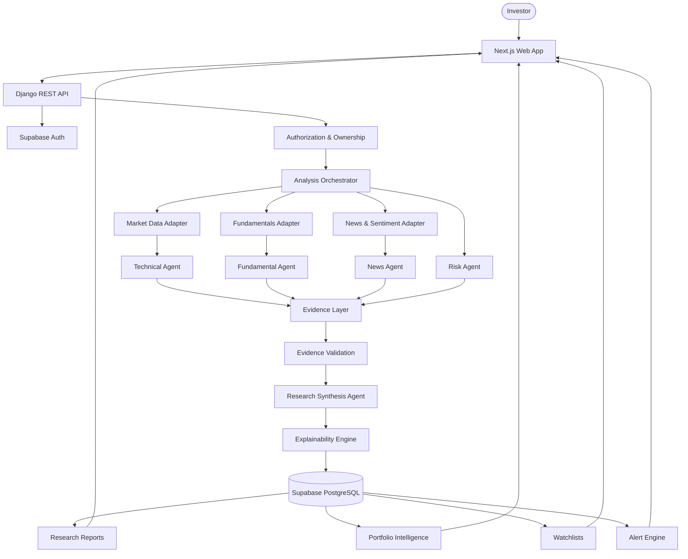

<div align="center">

# **StockLens**

### **Explainable AI Market Intelligence**

**Evidence → Multi-Agent Analysis → Explainable Research → Investor Intelligence**

<br>

[](https://nextjs.org/)
[](https://react.dev/)
[](https://www.typescriptlang.org/)
[](https://www.djangoproject.com/)
[](https://www.postgresql.org/)
[](https://supabase.com/)

</div>

---

# **01 · The Idea**

StockLens is an **evidence-driven financial intelligence platform** that converts fragmented market information into structured, explainable research.

Instead of sending a stock question directly to an LLM, StockLens builds a research pipeline:

> **Collect → Normalize → Analyze → Validate → Reason → Explain**

The model is a **reasoning layer**, not the source of market truth.

### **What StockLens analyzes**

- **Technical** — trend, momentum, indicators and volatility
- **Fundamental** — earnings, valuation, growth and financial health
- **News** — events, catalysts and sentiment
- **Risk** — volatility, drawdown, leverage, liquidity and concentration
- **Portfolio** — holdings, exposure and research context
- **Monitoring** — watchlists and threshold-based alerts

---

# **02 · System Architecture**



### **Architecture in one line**

```text
Client
  ↓
API Gateway
  ↓
Identity + Authorization
  ↓
Analysis Orchestrator
  ↓
Provider Adapters
  ↓
Specialized Agents
  ↓
Evidence Layer
  ↓
Validation
  ↓
AI Synthesis
  ↓
Explainability
  ↓
Persistent Research
  ↓
Investor Actions
```

---

# **03 · Core Workflow**

### **The complete research lifecycle**

| # | Stage | System Responsibility |
|:--:|---|---|
| **01** | **Request** | Investor initiates research for a stock |
| **02** | **Resolve** | Symbol is mapped to the canonical `Stock` entity |
| **03** | **Authenticate** | Supabase token is validated when applicable |
| **04** | **Orchestrate** | Analysis Orchestrator creates the research pipeline |
| **05** | **Acquire** | Market, fundamentals and news adapters collect source data |
| **06** | **Analyze** | Technical, Fundamental, News and Risk agents work independently |
| **07** | **Normalize** | Agent outputs become structured evidence |
| **08** | **Validate** | Source, timestamp, completeness and consistency are checked |
| **09** | **Synthesize** | Research Agent performs cross-domain reasoning |
| **10** | **Explain** | Conclusions are connected to supporting evidence |
| **11** | **Persist** | Research report is stored in PostgreSQL |
| **12** | **Act** | Portfolio, watchlist and alert workflows use the research |

### **Parallel analysis**

```text
                         RESEARCH REQUEST
                                │
                                ▼
                      ANALYSIS ORCHESTRATOR
                                │
             ┌──────────────────┼──────────────────┐
             │                  │                  │
             ▼                  ▼                  ▼
        MARKET DATA        FUNDAMENTALS           NEWS
             │                  │                  │
             ▼                  ▼                  ▼
        TECHNICAL           FUNDAMENTAL       NEWS / SENTIMENT
          AGENT                AGENT               AGENT
             └──────────────────┼──────────────────┘
                                │
                                ▼
                           RISK AGENT
                                │
                                ▼
                       EVIDENCE AGGREGATION
                                │
                                ▼
                       EVIDENCE VALIDATION
                                │
                                ▼
                      RESEARCH SYNTHESIS
                                │
                                ▼
                        EXPLAINABILITY
                                │
                                ▼
                         FINAL REPORT
```

**Why parallel agents?**

Independent research domains can execute concurrently, reducing unnecessary latency while keeping responsibilities isolated and testable.

---

# **04 · Evidence-First AI**

### **Traditional AI**

```text
User Prompt
     ↓
    LLM
     ↓
Generated Opinion
```

### **StockLens**

```text
Real Sources
     ↓
Provider Adapters
     ↓
Normalized Evidence
     ↓
Specialized Analysis
     ↓
Validation
     ↓
LLM Reasoning
     ↓
Explainable Research
```

### **Non-negotiable rule**

> **StockLens never fabricates prices, indicators, fundamentals, news or confidence scores.**

If a required provider is unavailable, the system returns a structured error instead of generating substitute data.

```json
{
  "error": "market_data_provider_not_configured",
  "detail": "The market_data provider is not configured."
}
```

---

# **05 · Multi-Agent Intelligence**

| Agent | Owns | Key Outputs |
|---|---|---|
| **Technical Agent** | Market behavior | Trend, RSI, moving averages, MACD, momentum, volatility |
| **Fundamental Agent** | Business quality | Earnings, valuation, growth, margins, leverage |
| **News Agent** | External events | News, sentiment, catalysts, event impact |
| **Risk Agent** | Downside analysis | Drawdown, volatility, liquidity, concentration |
| **Synthesis Agent** | Cross-domain reasoning | Overall research view and summary |
| **Explainability Engine** | Traceability | Conclusion → Evidence → Reason |

### **Agent design**

Each agent has a clear boundary:

```text
Input Data
    ↓
Domain-Specific Agent
    ↓
Structured Findings
    ↓
Evidence References
```

This keeps the system modular, testable and provider-independent.

---

# **06 · Technology Stack**

<div align="center">

### **Frontend**

| **Technology** | **Role** |
|---|---|
| **Next.js 16** | Application framework |
| **React 19** | UI layer |
| **TypeScript** | Type-safe development |
| **Tailwind CSS** | Design system |
| **Zustand** | Client state |
| **Recharts** | Market visualization |
| **Framer Motion** | Interaction & motion |

<br>

### **Backend & Platform**

| **Technology** | **Role** |
|---|---|
| **Python** | Backend runtime |
| **Django** | Application framework |
| **Django REST Framework** | API layer |
| **Supabase Auth** | Authentication & identity |
| **Supabase PostgreSQL** | Persistent data layer |

<br>

### **AI & Data**

| **Layer** | **Architecture** |
|---|---|
| **Market Data** | Provider Adapter |
| **Fundamentals** | Provider Adapter |
| **News** | Provider Adapter |
| **Technical Intelligence** | Technical Agent |
| **Risk Intelligence** | Risk Agent |
| **AI Research** | Evidence-Grounded LLM Synthesis |
| **Explainability** | Evidence → Conclusion Mapping |

</div>

---

# **07 · Data Architecture**


### **Data ownership**

```text
User
 │
 ├── Profile
 ├── Portfolio ─── Holdings ─── Stock
 ├── Watchlist ─── Items ────── Stock
 ├── Alerts ─────────────────── Stock
 └── Research Reports ───────── Stock
```

The ownership model keeps private financial resources isolated at the database/queryset layer.

---

# **08 · API Design**

### **Public Research**

```http
GET  /api/health/
GET  /api/stocks/
GET  /api/stocks/{symbol}/
GET  /api/stocks/{symbol}/technicals/
GET  /api/stocks/{symbol}/fundamentals/
GET  /api/stocks/{symbol}/news/
POST /api/stocks/{symbol}/analyze/
GET  /api/analysis/{id}/
```

### **Authenticated Resources**

```http
GET/PATCH                 /api/profile/
GET/POST/PUT/PATCH/DELETE /api/portfolios/
GET/POST/PUT/PATCH/DELETE /api/watchlists/
GET/POST/PUT/PATCH/DELETE /api/alerts/
```

### **API principles**

- REST over HTTPS
- JSON request/response format
- Django trailing-slash convention
- Bearer-token authentication
- Owner-scoped querysets
- Stable provider error envelope

---

# **09 · Security & Ownership**

```text
Supabase Auth
      │
      ▼
Access Token
      │
      ▼
Django Validation
      │
      ▼
Local User Provisioning
      │
      ▼
Authorization
      │
      ▼
Owner-Scoped Queryset
      │
      ▼
Private Resource
```

### **Security guarantees**

- Authentication is delegated to Supabase.
- Django controls application authorization.
- Supabase passwords are never stored by Django.
- Private portfolios, watchlists, alerts and reports are owner-scoped.
- Provider secrets never reach the frontend.
- Environment variables hold sensitive configuration.
- Unauthorized private reports return `404` to avoid resource enumeration.

---

# **10 · Portfolio Intelligence**

StockLens is designed to evolve from **stock research** into **investor-level intelligence**.

```text
                         STOCKLENS
                            │
             ┌──────────────┼──────────────┐
             ▼              ▼              ▼
        Stock Research   Portfolio      Watchlist
             │              │              │
             └──────────────┼──────────────┘
                            ▼
                     Risk & Alerts
                            │
                            ▼
                    Investor Dashboard
```

### Portfolio

- Holdings
- Quantity
- Average buy price
- Stock exposure

### Watchlist

- Named stock collections
- Research access
- Future event monitoring

### Alerts

- Price thresholds
- RSI thresholds
- Active/inactive state
- Trigger timestamps

---

# **11 · Production Safety**

StockLens follows a **fail-closed intelligence model**.

| Condition | Response |
|---|:---:|
| Invalid input | `400` |
| Authentication failure | `401` |
| Authorization failure | `403` |
| Resource unavailable | `404` |
| Synthesis unavailable | `501` |
| Provider unavailable | `503` |
| Successful read/update | `200` |
| Resource created | `201` |
| Resource deleted | `204` |

### **Core rule**

> **Missing evidence is acceptable. Fabricated evidence is not.**

Provider integrations are isolated behind adapters so the core system remains independent of any single data vendor.

---

# **12 · Development**

### **Backend**

```powershell
python -m venv .venv
.\.venv\Scripts\Activate.ps1

cd backend
pip install -r requirements.txt

python manage.py migrate
python manage.py runserver
```

### **Frontend**

```powershell
Copy-Item .env.local.example .env.local

npm install
npm run dev
```

### **Local services**

```text
Frontend   → http://localhost:3000
Backend    → http://127.0.0.1:8000
Health API → http://127.0.0.1:8000/api/health/
```

### **Validation**

```bash
python manage.py check
python manage.py test --settings=config.test_settings

npm run lint
npx tsc --noEmit
npm run build
```

---

# **13 · Roadmap**

```text
                    STOCKLENS MVP
                         │
        ┌────────────────┼────────────────┐
        ▼                ▼                ▼
   Market Data      Fundamentals      News/Sentiment
        └────────────────┼────────────────┘
                         ▼
                  Technical + Risk
                         │
                         ▼
               Evidence-Grounded AI
                         │
                         ▼
                 Real-Time Events
                         │
              ┌──────────┴──────────┐
              ▼                     ▼
        Smart Alerts          Portfolio Risk
              └──────────┬──────────┘
                         ▼
                Research Memory
                         │
                         ▼
                 Personalization
                         │
                         ▼
              Backtesting & Intelligence
```

---

# **14 · Engineering Principles**

<div align="center">

| **Principle** | **Decision** |
|---|---|
| **Evidence > Assumptions** | AI reasons over validated data |
| **Explainability > Black Box** | Conclusions remain traceable |
| **Real Data > Fabricated Data** | Missing providers fail explicitly |
| **Modularity > Lock-in** | Provider adapters isolate integrations |
| **Parallelism > Bottlenecks** | Independent agents execute concurrently |
| **Ownership > Shared State** | Private resources remain user-scoped |
| **Safe Failure > Silent Failure** | Errors are explicit and structured |

</div>

---

# **15 · Why StockLens**

Traditional market platforms primarily provide:

```text
Charts + Metrics + News
```

Generic AI products primarily provide:

```text
Prompt + Context → Generated Answer
```

StockLens combines the two into an **evidence-driven intelligence pipeline**:

```text
┌─────────────────────────────┐
│      REAL MARKET DATA       │
└──────────────┬──────────────┘
               ↓
┌─────────────────────────────┐
│     SPECIALIZED AGENTS      │
│ Technical · Fundamental     │
│ News · Risk                 │
└──────────────┬──────────────┘
               ↓
┌─────────────────────────────┐
│      EVIDENCE VALIDATION    │
└──────────────┬──────────────┘
               ↓
┌─────────────────────────────┐
│     CROSS-DOMAIN REASONING  │
└──────────────┬──────────────┘
               ↓
┌─────────────────────────────┐
│      EXPLAINABLE RESEARCH   │
└──────────────┬──────────────┘
               ↓
┌─────────────────────────────┐
│    INVESTOR INTELLIGENCE    │
└─────────────────────────────┘
```

### **The differentiator**

> **StockLens is not an AI chatbot that talks about stocks.**
>
> **It is a financial intelligence system that builds an evidence layer first, reasons across multiple research domains, and then explains every major conclusion.**

---

<div align="center">

## **StockLens**

### **Research with evidence. Reason with intelligence.**

</div>

---

> **Disclaimer:** StockLens is a research and market-intelligence platform. It does not guarantee investment returns and does not constitute financial advice.
