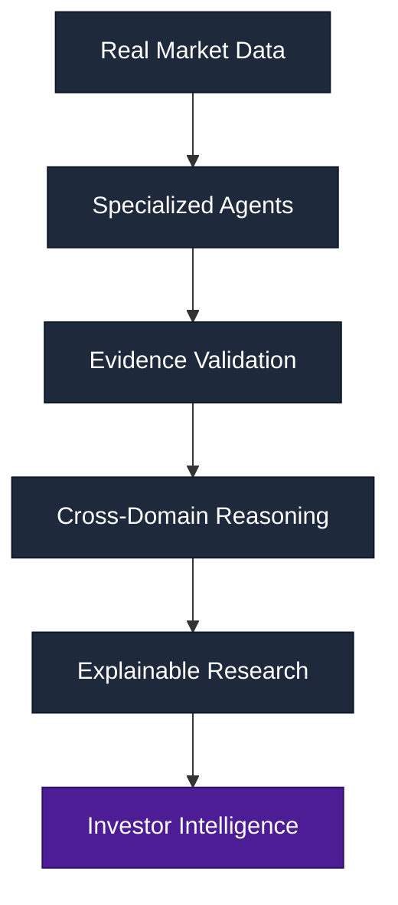
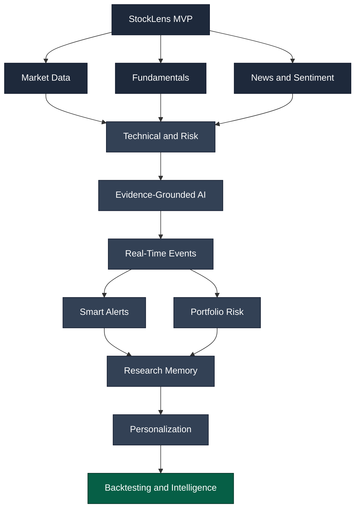
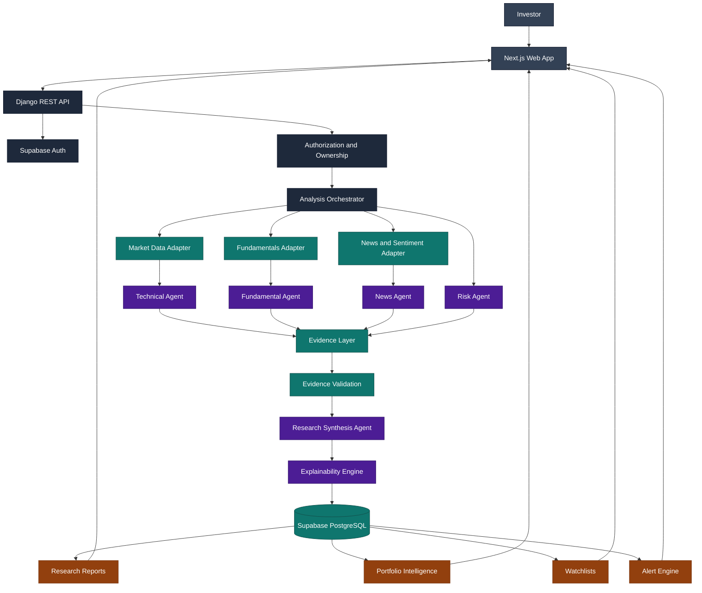
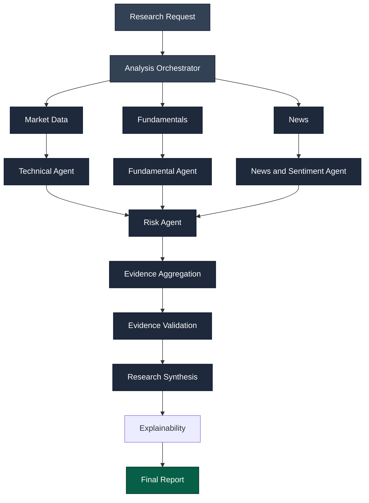
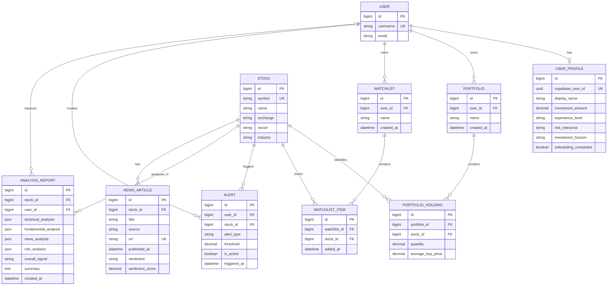
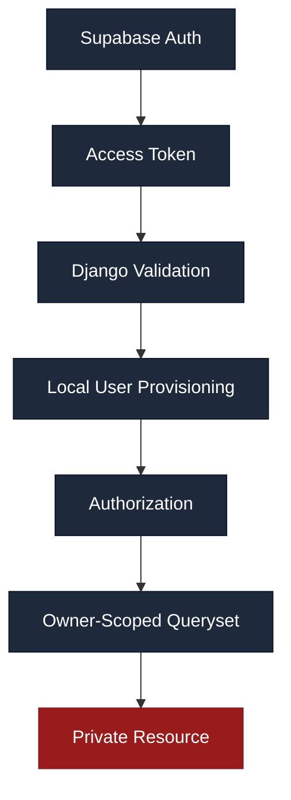
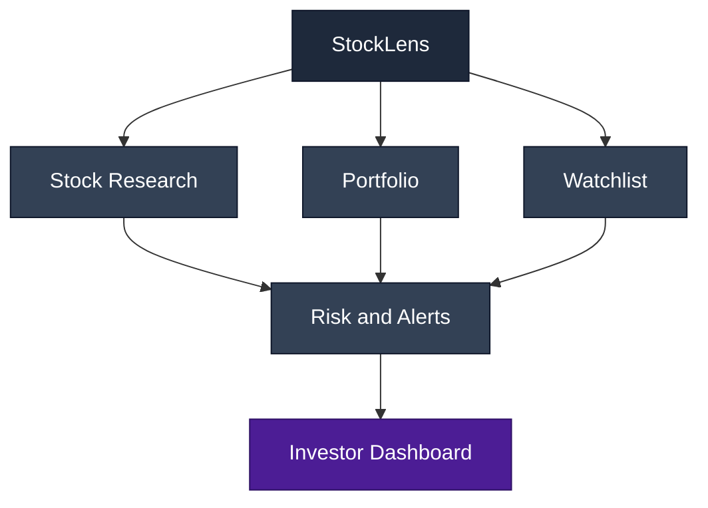

<div align="center">

# STOCKLENS

### Explainable AI Market Intelligence

**Evidence → Multi-Agent Analysis → Explainable Research → Investor Intelligence**

<br/>


<br/>


</div>

<br/>

---

## 01 · The Idea

**StockLens** is an evidence-driven financial intelligence platform that converts fragmented market information into structured, explainable research.

Instead of sending a stock question directly to an LLM, StockLens routes it through a disciplined research pipeline:

<div align="center">

**`Collect`** → **`Normalize`** → **`Analyze`** → **`Validate`** → **`Reason`** → **`Explain`**

</div>

> The model is a reasoning layer. It is never the source of market truth.

**What StockLens analyzes**

| Domain | Coverage |
|---|---|
| **Technical** | Trend, momentum, indicators, volatility |
| **Fundamental** | Earnings, valuation, growth, financial health |
| **News** | Events, catalysts, sentiment |
| **Risk** | Volatility, drawdown, leverage, liquidity, concentration |
| **Portfolio** | Holdings, exposure, research context |
| **Monitoring** | Watchlists, threshold-based alerts |

<br/>

---

## 02 · Why StockLens

<table>
<tr>
<td width="50%" valign="top">

**Traditional market platforms provide**

```
Charts + Metrics + News
```

Data on screen. No reasoning layer. The investor connects every dot manually.

</td>
<td width="50%" valign="top">

**Generic AI products provide**

```
Prompt + Context → Generated Answer
```

Fluent answers, but not always tied back to a verifiable source.

</td>
</tr>
</table>

**StockLens combines both into an evidence-driven intelligence pipeline:**



> StockLens is not an AI chatbot that talks about stocks. It is a financial intelligence system that builds an evidence layer first, reasons across multiple research domains, and then explains every major conclusion.

<br/>

---

## 03 · Roadmap



<br/>

---

## 04 · System Architecture



**Architecture in one line**

```
Client → API Gateway → Identity and Authorization → Analysis Orchestrator →
Provider Adapters → Specialized Agents → Evidence Layer → Validation →
AI Synthesis → Explainability → Persistent Research → Investor Actions
```

<br/>

---

## 05 · Core Workflow

| Step | Stage | System Responsibility |
|:---:|---|---|
| 01 | **Request** | Investor initiates research for a stock |
| 02 | **Resolve** | Symbol is mapped to the canonical `Stock` entity |
| 03 | **Authenticate** | Supabase token is validated when applicable |
| 04 | **Orchestrate** | Analysis Orchestrator creates the research pipeline |
| 05 | **Acquire** | Market, fundamentals, and news adapters collect source data |
| 06 | **Analyze** | Technical, Fundamental, News, and Risk agents work independently |
| 07 | **Normalize** | Agent outputs become structured evidence |
| 08 | **Validate** | Source, timestamp, completeness, and consistency are checked |
| 09 | **Synthesize** | Research Agent performs cross-domain reasoning |
| 10 | **Explain** | Conclusions are connected to supporting evidence |
| 11 | **Persist** | Research report is stored in PostgreSQL |
| 12 | **Act** | Portfolio, watchlist, and alert workflows use the research |

**Parallel analysis pipeline**



> **Why parallel agents.** Independent research domains execute concurrently, reducing latency while keeping responsibilities isolated and independently testable.

<br/>

---

## 06 · Evidence-First AI

<table>
<tr>
<td width="50%" valign="top">

**Traditional AI approach**

```
User Prompt → LLM → Generated Opinion
```

</td>
<td width="50%" valign="top">

**StockLens approach**

```
Real Sources → Provider Adapters →
Normalized Evidence → Specialized Analysis →
Validation → LLM Reasoning →
Explainable Research
```

</td>
</tr>
</table>

> **Non-negotiable rule.** StockLens never fabricates prices, indicators, fundamentals, news, or confidence scores. If a required provider is unavailable, the system returns a structured error instead of generating substitute data.

```json
{
  "error": "market_data_provider_not_configured",
  "detail": "The market_data provider is not configured."
}
```

<br/>

---

## 07 · Multi-Agent Intelligence

| Agent | Owns | Key Outputs |
|---|---|---|
| **Technical Agent** | Market behavior | Trend, RSI, moving averages, MACD, momentum, volatility |
| **Fundamental Agent** | Business quality | Earnings, valuation, growth, margins, leverage |
| **News Agent** | External events | News, sentiment, catalysts, event impact |
| **Risk Agent** | Downside analysis | Drawdown, volatility, liquidity, concentration |
| **Synthesis Agent** | Cross-domain reasoning | Overall research view and summary |
| **Explainability Engine** | Traceability | Conclusion → Evidence → Reason |

**Agent design**

```
Input Data → Domain-Specific Agent → Structured Findings → Evidence References
```

Each agent has a clear boundary, which keeps the system modular, testable, and provider-independent.

<br/>

---

## 08 · Technology Stack

**Frontend**

| Technology | Role |
|---|---|
| Next.js 16 | Application framework |
| React 19 | UI layer |
| TypeScript | Type-safe development |
| Tailwind CSS | Design system |
| Zustand | Client state |
| Recharts | Market visualization |
| Framer Motion | Interaction and motion |

**Backend and Platform**

| Technology | Role |
|---|---|
| Python | Backend runtime |
| Django | Application framework |
| Django REST Framework | API layer |
| Supabase Auth | Authentication and identity |
| Supabase PostgreSQL | Persistent data layer |

**AI and Data**

| Layer | Architecture |
|---|---|
| Market Data | Provider Adapter |
| Fundamentals | Provider Adapter |
| News | Provider Adapter |
| Technical Intelligence | Technical Agent |
| Risk Intelligence | Risk Agent |
| AI Research | Evidence-Grounded LLM Synthesis |
| Explainability | Evidence → Conclusion Mapping |

<br/>

---

## 09 · Database Schema



**Data ownership**

```
User
 ├── Profile
 ├── Portfolio ── Holdings ── Stock
 ├── Watchlist ── Items ───── Stock
 ├── Alerts ────────────────  Stock
 └── Research Reports ──────  Stock
```

The ownership model keeps private financial resources isolated at the database and queryset layer.

<br/>

---

## 10 · API Design

**Public Research**

```http
GET  /api/health/
GET  /api/stocks/
GET  /api/stocks/{symbol}/
GET  /api/stocks/{symbol}/quote/
GET  /api/stocks/{symbol}/history/
GET  /api/stocks/{symbol}/technicals/
GET  /api/stocks/{symbol}/fundamentals/
GET  /api/stocks/{symbol}/news/
POST /api/stocks/{symbol}/analyze/
GET  /api/analysis/{id}/
```

**Authenticated ML contracts**

```http
POST /api/research/run/
POST /api/ml/technical/predict/
POST /api/ml/fundamental/analyze/
POST /api/ml/news/analyze/
POST /api/ml/risk/analyze/
POST /api/ml/portfolio/analyze/
```

These endpoints return explicit unavailable states until timestamped provider data
and a deployed model artifact are configured; they do not return fabricated signals.

**Authenticated Resources**

```http
GET    /api/profile/
PATCH  /api/profile/
GET    /api/portfolios/
POST   /api/portfolios/
POST   /api/portfolios/demo/      # Create/restore the signed-in user's four-firm demo portfolio
PUT    /api/portfolios/{id}/
PATCH  /api/portfolios/{id}/
DELETE /api/portfolios/{id}/
GET    /api/watchlists/
POST   /api/watchlists/
PUT    /api/watchlists/{id}/
PATCH  /api/watchlists/{id}/
DELETE /api/watchlists/{id}/
GET    /api/alerts/
POST   /api/alerts/
PUT    /api/alerts/{id}/
PATCH  /api/alerts/{id}/
DELETE /api/alerts/{id}/
```

**API principles**

- REST over HTTPS
- JSON request and response format
- Django trailing-slash convention
- Bearer-token authentication
- Owner-scoped querysets
- Stable provider error envelope

<br/>

---

## 11 · Security and Ownership



**Security guarantees**

- Authentication is delegated to Supabase
- Django controls application authorization
- Supabase passwords are never stored by Django
- Private portfolios, watchlists, alerts, and reports are owner-scoped
- Provider secrets never reach the frontend
- Environment variables hold sensitive configuration
- Unauthorized private reports return `404` to avoid resource enumeration

<br/>

---

## 12 · Portfolio Intelligence

StockLens is designed to evolve from stock research into investor-level intelligence.



| Portfolio | Watchlist | Alerts |
|---|---|---|
| Holdings | Named stock collections | Price thresholds |
| Quantity | Research access | RSI thresholds |
| Average buy price | Future event monitoring | Active/inactive state |
| Stock exposure | | Trigger timestamps |

<br/>

---

## 13 · Development

**Backend**

```powershell
python -m venv .venv
.\.venv\Scripts\Activate.ps1

cd backend
pip install -r requirements.txt

python manage.py migrate
python manage.py runserver
```

**Frontend**

```powershell
Copy-Item .env.local.example .env.local

npm install
npm run dev
```

**Google sign-in checklist**

1. In Supabase Auth, enable Google and paste the OAuth client ID and secret from Google Cloud.
2. Add `http://localhost:3000/auth/callback` (and the production equivalent) to Supabase Auth redirect URLs.
3. In Google Cloud OAuth credentials, add the Supabase callback URL shown in Supabase’s Google provider setup—not the frontend URL directly.
4. Copy the same Supabase URL and publishable key to `.env.local` and `backend/.env`.

The frontend shows the actual provider error if any of these are missing; it never reports a false successful login.

**Train the technical model**

After installing backend dependencies and setting `MARKET_DATA_PROVIDER=yfinance` in `backend/.env`, run:

```powershell
cd backend
python -m api.training.train_technical AAPL MSFT NVDA RELIANCE.NS TCS.NS
```

The command trains a compact logistic trend model from real historical OHLCV bars and saves a local artifact at `api/model_artifacts/technical_logistic_v1.json`. The research API automatically uses that artifact; without it, it labels the inference version as `baseline-1.0` rather than claiming a trained result.

**Local services**

| Service | URL |
|---|---|
| Frontend | `http://localhost:3000` |
| Backend | `http://127.0.0.1:8000` |
| Health API | `http://127.0.0.1:8000/api/health/` |

**Validation**

```bash
python manage.py check
python manage.py test --settings=config.test_settings

npm run lint
npx tsc --noEmit
npm run build
```

<br/>

---

## 14 · Production Safety

StockLens follows a fail-closed intelligence model.

| Condition | Response |
|---|:---:|
| Invalid input | `400` |
| Authentication failure | `401` |
| Authorization failure | `403` |
| Resource unavailable | `404` |
| Synthesis unavailable | `501` |
| Provider unavailable | `503` |
| Successful read/update | `200` |
| Resource created | `201` |
| Resource deleted | `204` |

> **Core rule.** Missing evidence is acceptable. Fabricated evidence is not.

Provider integrations are isolated behind adapters so the core system remains independent of any single data vendor.

<br/>

---

<div align="center">

## StockLens

### Research with evidence. Reason with intelligence.

<br/>

<sub>**Disclaimer:** StockLens is a research and market-intelligence platform. It does not guarantee investment returns and does not constitute financial advice.</sub>

</div>
