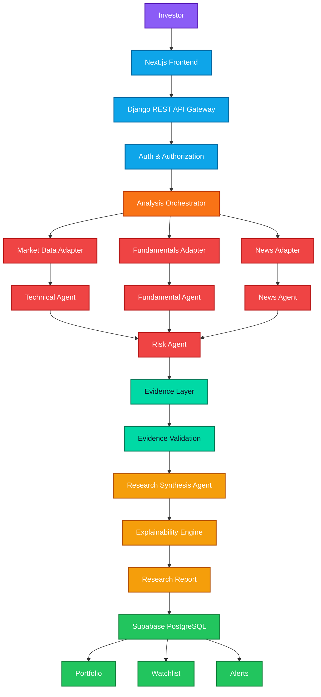
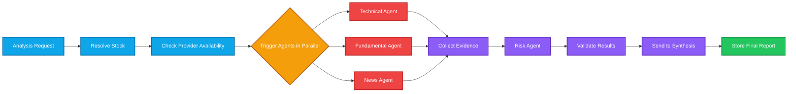
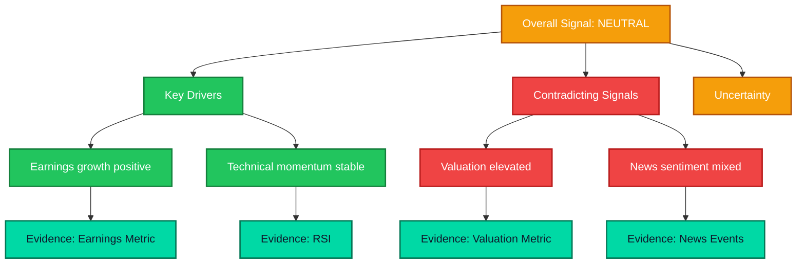
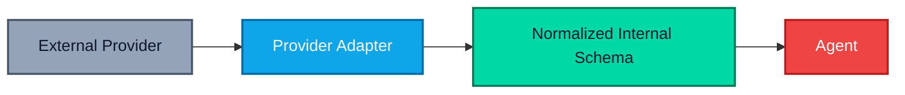
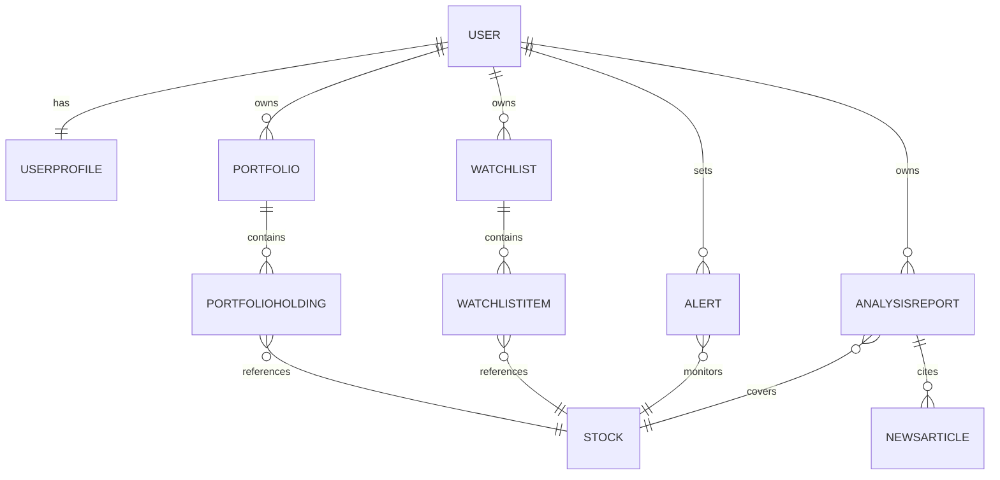
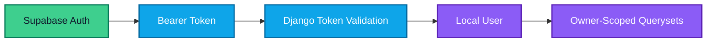
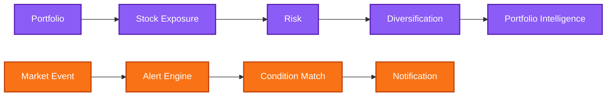

<div align="center">


<h1>StockLens</h1>
<h3>Evidence-First Multi-Agent Financial Intelligence Platform</h3>

<p>StockLens does not tell investors what to think. It shows the evidence, connects the signals, explains the reasoning, and makes uncertainty visible.</p>

<p>
  
  
  
  
</p>

<p>
  
  
  
  
  
</p>

<sub><b>Getting Started</b> &nbsp;·&nbsp; <b>API Reference</b> &nbsp;·&nbsp; <b>Architecture</b> &nbsp;·&nbsp; <b>Roadmap</b></sub>

</div>

<br/>

<table align="center">
<tr>
<td align="center" width="20%"><b>7</b><br/><sub>Specialized AI Agents</sub></td>
<td align="center" width="20%"><b>100%</b><br/><sub>Traceable Conclusions</sub></td>
<td align="center" width="20%"><b>0</b><br/><sub>Fabricated Data Points</sub></td>
<td align="center" width="20%"><b>3</b><br/><sub>Independent Providers</sub></td>
<td align="center" width="20%"><b>P0–P2</b><br/><sub>Staged Delivery</sub></td>
</tr>
</table>

<br/>

---

## Table of Contents

| | | |
|---|---|---|
| [01 · About](#about) | [08 · Explainability Engine](#explainability-engine) | [15 · Frontend Experience](#frontend-experience) |
| [02 · The Problem](#the-problem) | [09 · Tech Stack](#tech-stack) | [16 · Portfolio, Watchlist & Alerts](#portfolio-watchlist--alerts) |
| [03 · Product Philosophy](#product-philosophy) | [10 · Data Provider Architecture](#data-provider-architecture) | [17 · Project Structure](#project-structure) |
| [04 · Core Differentiator](#core-differentiator) | [11 · Database Schema](#database-schema) | [18 · Getting Started](#getting-started) |
| [05 · System Workflow](#system-workflow) | [12 · API Reference](#api-reference) | [19 · Roadmap](#roadmap) |
| [06 · Multi-Agent Research Pipeline](#multi-agent-research-pipeline) | [13 · Authentication & Authorization](#authentication--authorization) | [20 · Engineering Principles](#engineering-principles) |
| [07 · Evidence Layer & Validation](#evidence-layer--validation) | [14 · Safe Failure Architecture](#safe-failure-architecture) | |

---

## About

**StockLens** is a production-grade financial research platform that transforms scattered market signals — price action, fundamentals, news, and risk — into a single, explainable investment thesis.

Rather than surfacing raw metrics or generating a one-shot AI opinion, StockLens runs independent, specialized agents over validated real-world evidence, then synthesizes their findings into a research report where every conclusion is traceable back to its source.

> **This is not an AI chatbot bolted onto a ticker search.**
> It is a financial intelligence command center — engineered the way a serious fintech product should be.

---

## The Problem

Investors already have data everywhere:

| Signal | Typically lives in |
|---|---|
| Price charts | Trading terminals |
| Technical indicators | Charting tools |
| Financial statements | Broker apps |
| Company fundamentals | Screener platforms |
| News & sentiment | Aggregators, social feeds |
| Risk metrics | Nowhere consistent |
| Portfolio exposure | Spreadsheets |

The problem was never data availability. It is the absence of a system that explains **how these signals connect** and **why they lead to a particular view.**

---

## Product Philosophy

```
DATA → EVIDENCE → SPECIALIZED ANALYSIS → VALIDATION → AI REASONING → EXPLANATION → INVESTOR INTELLIGENCE
```

The LLM is treated strictly as a reasoning layer over validated evidence — never as the source of market truth.

**User journey**

```
Landing Page → Search Stock → Stock Intelligence Page → Analyze Stock
   → Analysis Orchestrator → Parallel Research Agents → Evidence Layer
   → AI Synthesis → Explainable Research Report → Portfolio / Watchlist / Alert
```

Every screen is designed to answer five questions:

| # | Question |
|---|---|
| 1 | What is happening? |
| 2 | Why is it happening? |
| 3 | What evidence supports it? |
| 4 | What are the risks? |
| 5 | What could invalidate this view? |

---

## Core Differentiator

<table>
<tr>
<th align="center">Traditional Platform</th>
<th align="center">Generic AI Tool</th>
<th align="center">StockLens</th>
</tr>
<tr>
<td valign="top">

```
Charts
Metrics
News
```
No synthesis.

</td>
<td valign="top">

```
Prompt
  ↓
LLM
  ↓
Answer
```
No evidence.

</td>
<td valign="top">

```
Real Data
  ↓
Specialized Agents
  ↓
Evidence
  ↓
Validation
  ↓
Cross-Domain Reasoning
  ↓
Explainability
```
Fully traceable.

</td>
</tr>
</table>

---

## System Workflow

### High-Level Architecture



### Analysis Orchestrator — Parallel Agent Execution



### Explainability Trace



---

## Multi-Agent Research Pipeline

| Agent | Analyzes | Key Outputs |
|---|---|---|
| **Technical Agent** | Historical OHLCV, volume, price action | SMA, EMA, RSI, MACD, Bollinger Bands, momentum, volatility, trend, support/resistance |
| **Fundamental Agent** | Financial statements & company health | Revenue, EPS, P/E, P/B, ROE, margins, debt, cash flow, growth |
| **News & Sentiment Agent** | Provider-backed news & events | Title, source, URL, published time, sentiment, sentiment score, catalysts |
| **Risk Agent** | Volatility, drawdown, liquidity, leverage, concentration, sector & market exposure | Risk factor, severity, evidence, explanation, potential impact |
| **Research Synthesis Agent** | Cross-domain reasoning over all evidence | Technical / fundamental / news / risk views, overall signal, key drivers, contradictions, uncertainty |

> **Golden rule.** No agent may fabricate a value. If a data point is unavailable, the agent reports it as missing — never estimated.

---

## Evidence Layer & Validation

Every agent output is normalized into a single evidence schema:

```json
{
  "source": "string",
  "source_type": "market_data | fundamentals | news | risk",
  "timestamp": "ISO-8601",
  "metric": "string",
  "value": "any",
  "interpretation": "string",
  "confidence": "HIGH | MEDIUM | LIMITED",
  "reference": "string"
}
```

Before synthesis, evidence is validated against:

| Check | Purpose |
|---|---|
| Source availability | Confirms the provider actually returned data |
| Timestamp freshness | Prevents stale evidence from driving a live signal |
| Data completeness | Flags partial records before they reach synthesis |
| Schema correctness | Rejects malformed evidence at the boundary |
| Conflicting signals | Surfaces contradictions instead of averaging them away |
| Provider reliability | Tracks source trustworthiness over time |

Invalid or missing evidence is flagged — never silently replaced.

---

## Explainability Engine

Every conclusion in a StockLens report is traceable to its underlying evidence.

```
Overall View: NEUTRAL

Why?
  + Earnings growth remains positive
  + Technical momentum is stable
  − Valuation remains elevated
  − Recent news sentiment is mixed

Evidence:
  → Earnings metric
  → RSI
  → Valuation metric
  → Recent news events
```

Confidence is layered, never invented:

| Layer | Measures |
|---|---|
| **Data Confidence** | How complete is the underlying evidence |
| **Model Confidence** | How consistent is the agent reasoning |
| **Market Uncertainty** | How volatile or ambiguous is the current signal |

If evidence is incomplete, the system reports it plainly:

```
Confidence: LIMITED
Reason: Historical data is unavailable for the requested period.
```

StockLens says "insufficient evidence" rather than producing a confident, fabricated answer.

---

## Tech Stack

<table>
<tr>
<td valign="top" width="25%">

**Frontend**

<br/>
<br/>
<br/>
<br/>
<br/>
<br/>


</td>
<td valign="top" width="25%">

**Backend**

<br/>
<br/>


**Data & Auth**

<br/>


</td>
<td valign="top" width="25%">

**AI Architecture**

<br/>
<br/>


</td>
<td valign="top" width="25%">

**External Integrations**
*(all via adapters)*

<br/>
<br/>
<br/>


</td>
</tr>
</table>

---

## Data Provider Architecture



Required adapters: `MarketDataAdapter`, `FundamentalsAdapter`, `NewsAdapter`. The core research engine never depends on a single vendor — providers can be swapped without rewriting analysis logic.

---

## Database Schema

**Core entities:** `User` · `UserProfile` · `Stock` · `Portfolio` · `PortfolioHolding` · `Watchlist` · `WatchlistItem` · `Alert` · `AnalysisReport` · `NewsArticle`



**Key constraints**

| Constraint | Rule |
|---|---|
| Stock symbol | Globally unique |
| User profile | One per user |
| Portfolio holdings | Unique per `(portfolio, stock)` |
| Watchlist items | Unique per `(watchlist, stock)` |
| News article URL | Unique |
| Holding quantity | Must be positive |
| Buy price | Non-negative |
| Private reports | Strictly owner-scoped |

---

## API Reference

**Public**

```http
GET  /api/health/
GET  /api/stocks/
GET  /api/stocks/{symbol}/
GET  /api/stocks/{symbol}/technicals/
GET  /api/stocks/{symbol}/fundamentals/
GET  /api/stocks/{symbol}/news/
POST /api/stocks/{symbol}/analyze/
GET  /api/analysis/{id}/
```

**Authenticated**

```http
GET/PATCH                     /api/profile/
GET/POST/PUT/PATCH/DELETE     /api/portfolios/
GET/POST/PUT/PATCH/DELETE     /api/watchlists/
GET/POST/PUT/PATCH/DELETE     /api/alerts/
```

**Status codes**

| Code | Meaning |
|---|---|
| `200` | Success |
| `201` | Created |
| `204` | Deleted |
| `400` | Invalid Input |
| `401` | Authentication Failure |
| `403` | Forbidden |
| `404` | Not Found |
| `501` | Synthesis Not Configured |
| `503` | Provider Not Configured |

---

## Authentication & Authorization



Supported flows: Google OAuth, email/password, session management, access tokens. Anonymous users can access public stock research; authenticated users unlock portfolios, watchlists, alerts, and private history.

**Private resources:** Profile · Portfolio · Portfolio holdings · Watchlists · Alerts · Private analysis reports

> A private report belonging to another user returns `404`, never `403` — its existence is never leaked.

---

## Safe Failure Architecture

> **Missing data is always better than fake data.**

If a provider isn't configured, StockLens fails loudly and honestly instead of guessing:

```json
{
  "error": "market_data_provider_not_configured",
  "detail": "The market_data provider is not configured."
}
```

Local demo data may be used for frontend visualization only — production analysis always runs on real, provider-backed data.

---

## Frontend Experience

Designed as a high-end financial intelligence terminal, not a generic SaaS dashboard.

| Page | Shows |
|---|---|
| **Landing** | Value proposition, evidence-first architecture, example research output |
| **Dashboard** | Market overview, watchlist, recent research, portfolio snapshot, alerts |
| **Stock Research** | Price, chart, technicals, fundamentals, news, risk, AI research, evidence |
| **Portfolio** | Holdings, allocation, exposure, risk, research insights |
| **Watchlist** | Stocks, latest signals, changes, alerts |
| **Research History** | Previous analyses, timestamps, signal drift over time |

**Design language:** dark-first premium interface, strong typography, dense but readable data, subtle borders, professional cards, minimal gradients, controlled motion, high-quality charts, real skeleton loaders, accessible contrast.

**Deliberately avoided:** glassmorphism overload, decorative gradients, sparkle iconography, chatbot styling, over-rounded cards.

---

## Portfolio, Watchlist & Alerts



| Feature | Detail |
|---|---|
| **Portfolio** | Tracks quantity, average buy price, exposure, composition |
| **Watchlist** | Named lists — `Long Term`, `AI Stocks`, `Indian Tech`, `High Growth` |
| **Alerts** | Threshold-based — `PRICE_ABOVE` · `PRICE_BELOW` · `RSI_ABOVE` · `RSI_BELOW` |

```
Stock: AAPL
Condition: PRICE_ABOVE
Threshold: 4250
Status: ACTIVE
```

---

## Project Structure

```
stocklens/
├── frontend/
│   ├── app/
│   ├── components/
│   ├── lib/
│   ├── store/
│   └── types/
│
├── backend/
│   ├── config/
│   ├── apps/
│   │   ├── users/
│   │   ├── stocks/
│   │   ├── portfolios/
│   │   ├── watchlists/
│   │   ├── alerts/
│   │   └── analysis/
│   │
│   ├── services/
│   │   ├── adapters/
│   │   ├── agents/
│   │   ├── orchestrator/
│   │   └── synthesis/
│   │
│   └── manage.py
│
├── docs/
├── .env.example
├── README.md
└── docker-compose.yml
```

Domain logic is kept strictly separate from API views.

---

## Getting Started

**Backend**

```powershell
python -m venv .venv
.\.venv\Scripts\Activate.ps1

cd backend
pip install -r requirements.txt

python manage.py migrate
python manage.py runserver
```

**Frontend**

```powershell
npm install
npm run dev
```

**Validation**

```bash
python manage.py check
python manage.py test --settings=config.test_settings

npm run lint
npx tsc --noEmit
npm run build
```

---

## Roadmap

| Phase | Scope |
|---|---|
| **P0 — Core** | Auth, stock search & detail, technical/fundamental/news/risk analysis, orchestration, evidence layer, explainable reports, PostgreSQL persistence |
| **P1 — Personal Intelligence** | Portfolio, watchlist, alerts, research history |
| **P2 — Advanced** | Real-time monitoring, background workers, portfolio optimization, research memory, backtesting, personalization |

**Scaling path** — introducible without major architectural change: Redis · Celery / Task Queue · Streaming Events · Background Workers · Provider Failover.

---

## Engineering Principles

| Principle | Over |
|---|---|
| Evidence | Assumptions |
| Explainability | Black Box |
| Real Data | Fabricated Data |
| Modularity | Vendor Lock-in |
| Parallelism | Sequential Bottlenecks |
| Security | Convenience |
| Observable | Silent |
| Fail-Safe | Hallucinated |

<div align="center">

<br/>


<h3>StockLens — Evidence In. Intelligence Out.</h3>

</div>
